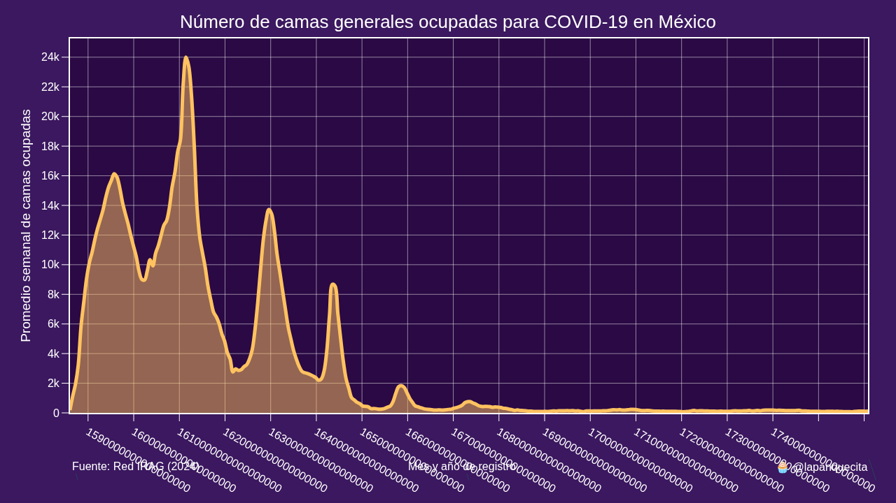
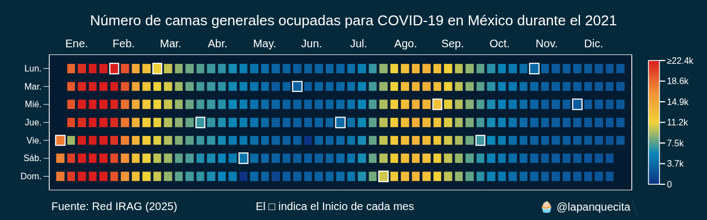
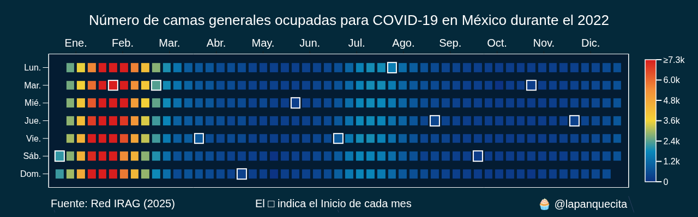
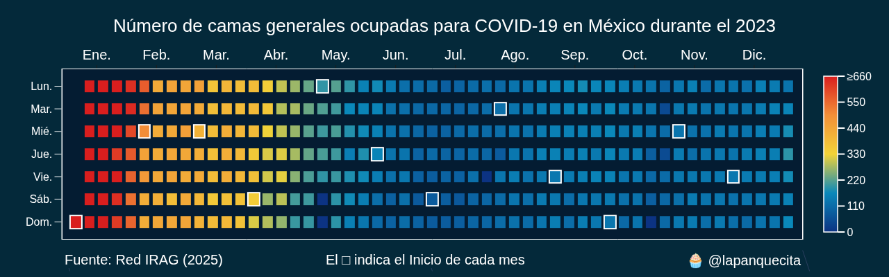
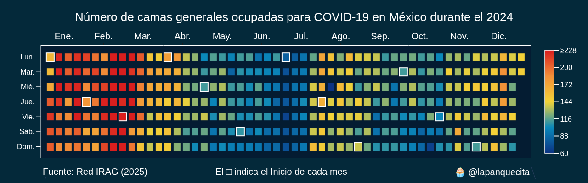

# Red IRAG

El sitio web de la red IRAG (https://www.gits.igg.unam.mx/red-irag-dashboard/reviewHome) se encarga de llevar el seguimiento de los pacientes hospitalizados por COVID-19 en México.

Desafortunadamente en casi todas las secciones del sitio web solo se muestran porcentajes y no cifras absolutas, por lo tanto no sabemos exactamente que tan grave es la situación en cada hospital, entidad o en el país.

La única sección donde existen cifras absolutas es en la ocupación de camas generales a nivel nacional.

Este repositorio tiene el propósito de obtener dicha información mediante web scraping y almacenarla en un archivo CSV.

Con este archivo CSV se pueden generar gráficas como las siguientes.

## Gráfica de área

## Gráficas de tipo calendario

## Contenido

* scraper.py: Programa para obtener los datos de ocupaci;on de camgas generales en México y guardarlos en CSV.

* plotter.py: Programa para generar las gráficas anteriores.

* data.csv: Dataset con la ocupación de camas generales por día en forma de series de tiempo.

## Conclusión

A pesar de la simpleza de este proyecto, nos permite fácilmente determinar cuales han sido los puntos más graves durante la pandemia de COVID-19 en México.
